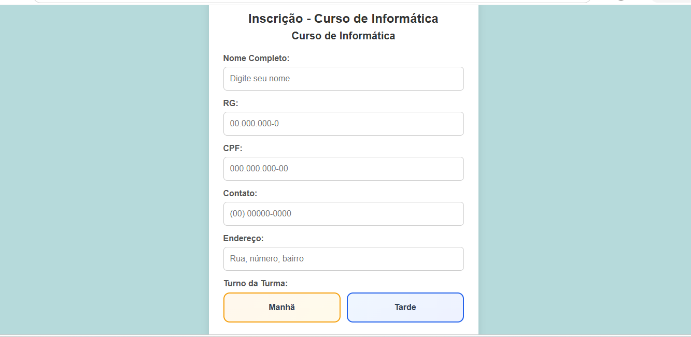
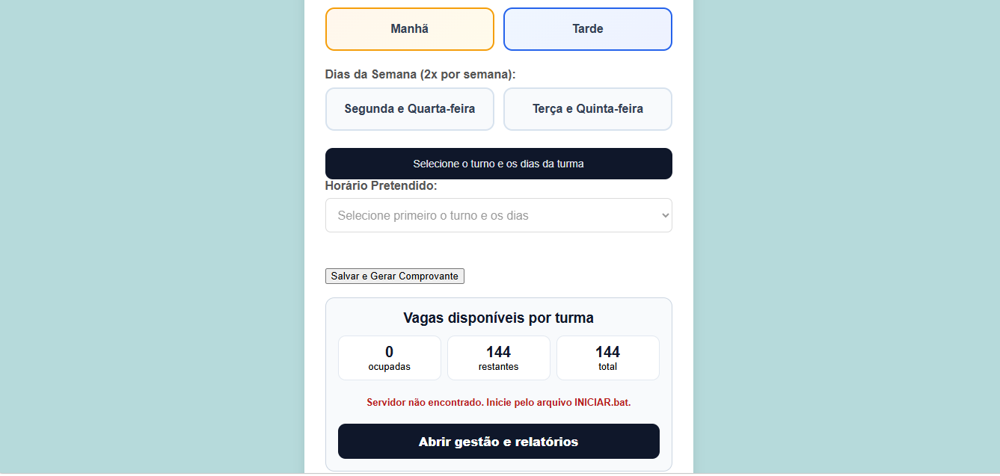
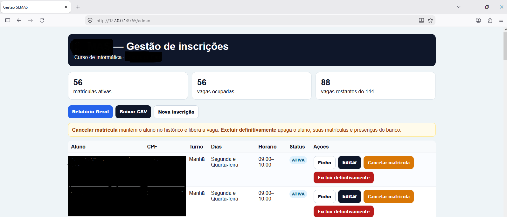

# Sistema de Inscrições e Cadastros v1.0.0
## Telas do sistema

Este é um mini servidor web desenvolvido em **Python** com interface em **HTML** e banco de dados **SQLite** para o cadastro e gerenciamento de registros de forma simples e leve. O projeto foi estruturado inicialmente para o controle de **turmas de alunos**, mas possui uma arquitetura flexível que permite sua fácil adaptação para outros nichos, como clínicas e escritórios.

## 📋 Pré-requisitos

Antes de iniciar, você precisa ter instalado no seu computador:
1. **Python 3** (Certifique-se de marcar a opção *"Add Python to PATH"* durante a instalação).
2. **SQLite** (Necessário para a gestão do banco de dados local).

---

## 🚀 Como Executar o Projeto

A execução do sistema é totalmente automatizada para sistemas Windows:

1. Baixe e extraia os arquivos deste repositório em uma pasta no diretório C do sistema.
2. Dê um duplo clique no arquivo **`iniciar.bat`**.
3. O script irá **criar automaticamente as tabelas** necessárias no banco de dados SQLite, iniciar o mini servidor e **abrir a interface direto no seu navegador padrão**.

---

## 🛠️ Como Adaptar para Outros Cenários

O sistema foi feito para ser modular. Se você deseja utilizá-lo para outra finalidade que não seja escolar, siga os passos abaixo para customizar a interface e os dados:

### 1. Modificando para uma Clínica (Pacientes/Consultas)
* **No arquivo HTML:** Altere os rótulos (`<label>`) dos campos do formulário de "Nome do Aluno" ou "Turma" para **"Nome do Paciente"**, **"Convênio"** ou **"Especialidade"**.
* **No arquivo Python:** Altere a query SQL de criação de tabelas para gerar colunas como `paciente_nome` ou `convenio` e atualize a rota que recebe o formulário.

### 2. Modificando para um Escritório (Clientes/Processos)
* **No arquivo HTML:** Substitua as informações visuais por dados como **"Nome do Cliente"**, **"Tipo de Serviço"** ou **"Status do Projeto"**.
* **No arquivo Python:** Atualize a estrutura da tabela no banco SQLite e as variáveis que processam os dados para refletir o novo fluxo do escritório.

---

## ⚙️ Tecnologias Utilizadas

* **Python** (Servidor local e lógica de backend)
* **SQLite** (Banco de dados relacional embutido)
* **HTML5 / CSS3** (Interface do usuário e estilização)
* **Batch Script (.bat)** (Automação completa de inicialização e abertura do navegador no Windows)

## 📄 Licença

Este projeto é de código aberto e está disponível sob a licença MIT. Sinta-se livre para clonar, modificar e distribuir conforme suas necessidades.
